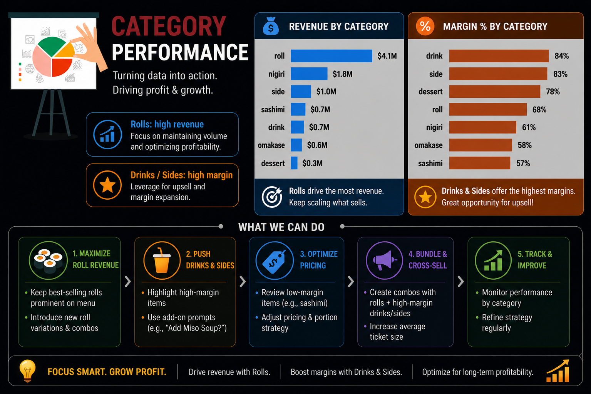

# 📊 sushi_restaurant_menu_pricing_optimization
## 🚀 Summary
Data-driven analysis to identify high-revenue, low-margin items and optimize menu pricing for maximum profitability.
### 📑 Table of Contents
* [Overview](#overview)
* [Problem Statement](#problem-statement)
* [Dataset](#dataset)
* [Tools and Technologies](#tools-and-technologies)
* [Methods](#methods)
* [Key Insights](#key-insights)
* [Dashboard](#dashboard)
* [Final Thoughts](#final-thoughts)
* [Future Work](#future-work)
* [Author & Contact](#author--contact)
## 📌 Overview
- This project focuses on analyzing restaurant sales data (2015–2024) to uncover pricing inefficiencies and improve profitability.
- Using Python for analysis and Power BI for visualization, the project identifies key revenue drivers, margin gaps, and strategic opportunities.
## 🎯 Problem Statement
- Identify high-revenue but low-margin items
- Understand impact of cost and inflation on pricing
- Detect underpriced high-demand products
- Enable data-driven pricing decisions
## 📂 Dataset
- 83K+ Orders
- 999K+ Items Sold
- Time Period: 2015–2024
- Columns: Item, Category, Price, Cost, Revenue, Profit, Margin %, Channel, Customer Segment
## 🛠 Tools and Technologies
- Python (Pandas, Data Analysis)
- Power BI (Dashboard & Visualization)
- Generative AI (analysis support and Insight generation support)
- Prompt Engineering
## ⚙️ Methods
- Data Cleaning & Preprocessing
- Feature Engineering (Revenue, Profit, Margin %)
- Exploratory Data Analysis (EDA)
- Aggregations (Item, Category, Channel, Segment)
- Trend Analysis (Year-wise performance)
- Visualization & Dashboard Building
## 🔥 Key Insights
1) ## 📊 Insight 1
High revenue items (Rolls, Nigiri) generate maximum sales but have relatively lower margins → pricing opportunity.

