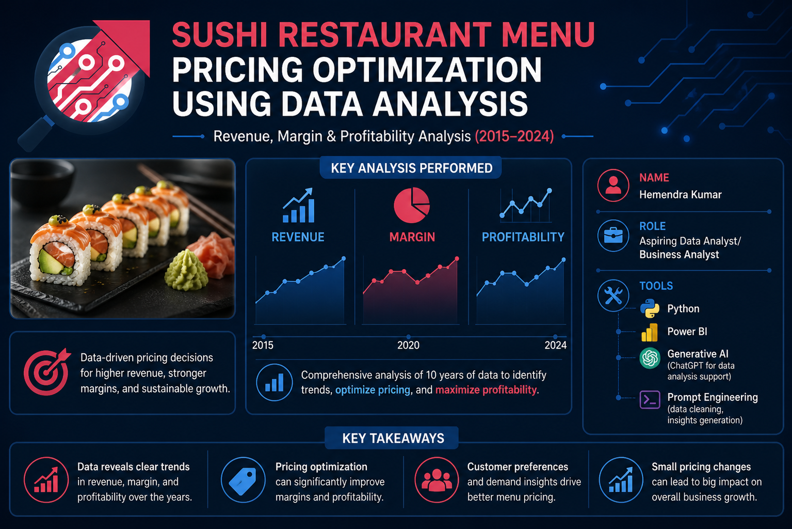
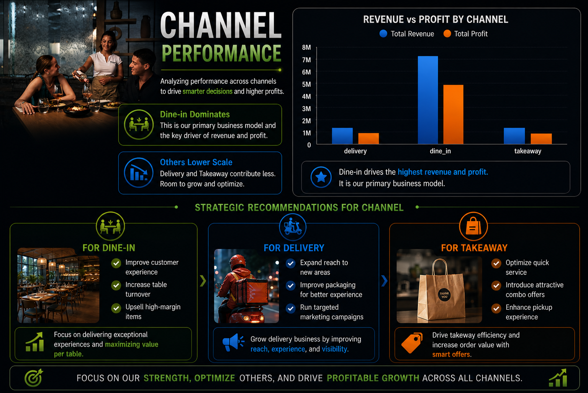
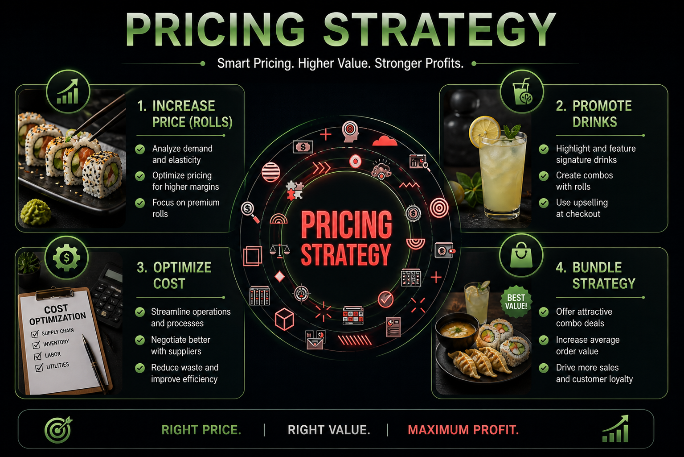
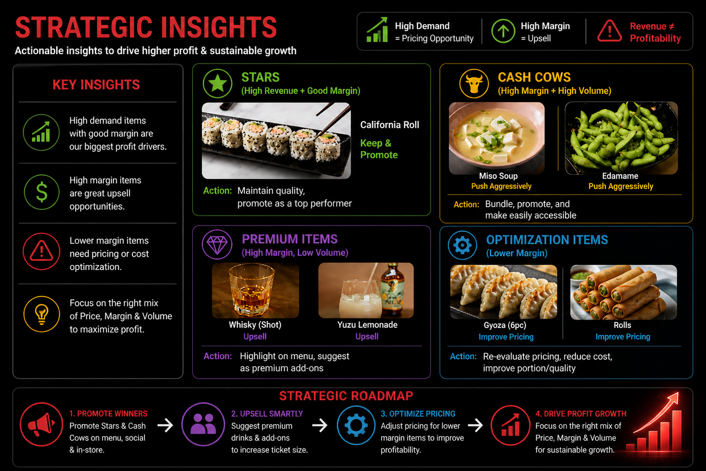
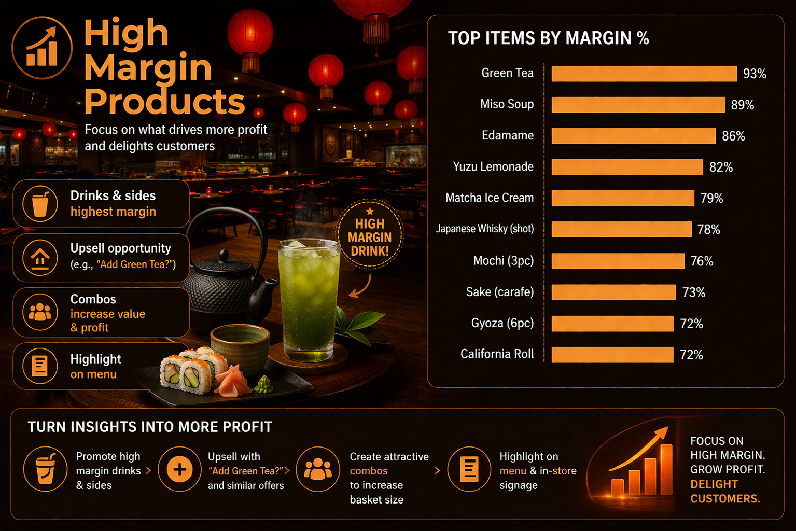
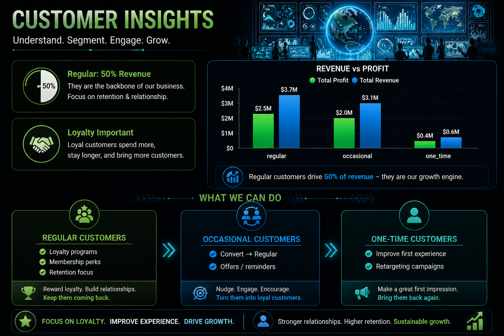
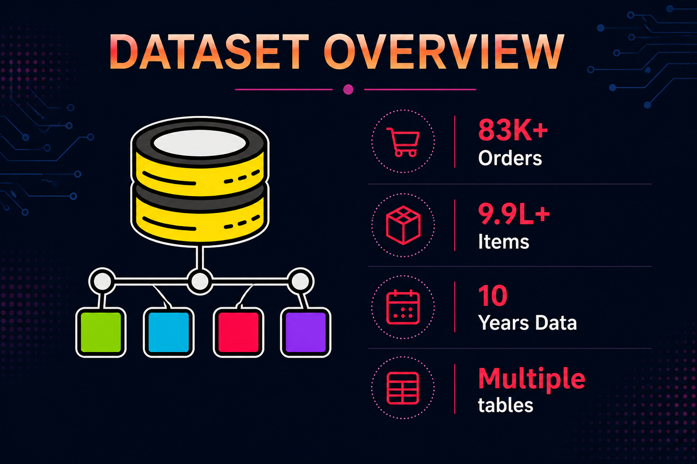
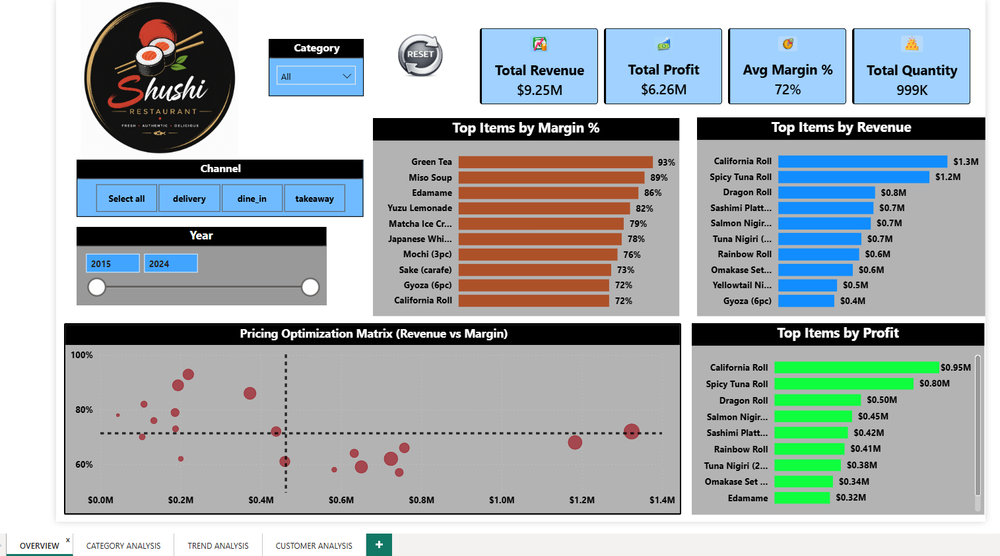
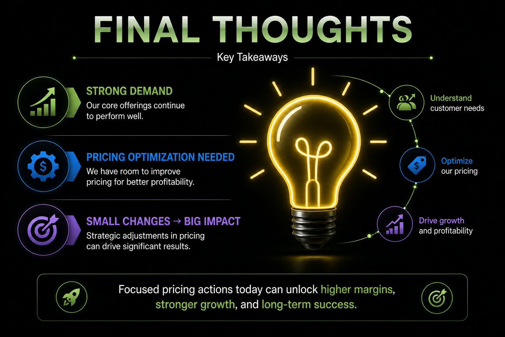

# 📊 Sushi Restaurant Menu Pricing Optimization 

### 🚀 Brief One Line Summary
Data-driven analysis to identify high-revenue, low-margin items and optimize menu pricing for maximum profitability.

---

## 📁 Project Structure

- sushi-restaurant-analysis/
  - dashboard/
    - dashboard.pbix
  - images/
    - category_performance.png
    - channel_performance.png
    - customer_insights.png
    - dashboard_ss.png
    - dataset_overview.png
    - final_conclusion.png
    - high_margin.png
    - strategic_insights.png
    - sushi_restaurant.png
  - python_script/
    - sushi_menu_price_optimization.ipynb
  - README.md

---

### 📑 Table of Contents
* [Overview](#-overview)
* [Problem Statement](#-problem-statement)
* [Business Insights & Strategic Recommendations](#-business-insights--strategic-recommendations)
* [Dataset](#-dataset)
* [Tools and Technologies](#-tools-and-technologies)
* [Methods](#%EF%B8%8F-methods)
* [Dashboard](#-dashboard)
* [Final Thoughts](#-final-thoughts)
* [Future Work](#-future-work)
* [Author & Contact](#author-contact)

---

### 📌 Overview
This project focuses on analyzing restaurant sales data (2015–2024) to uncover pricing inefficiencies and improve profitability.  
Using Python for analysis and Power BI for visualization, the project identifies key revenue drivers, margin gaps, and strategic opportunities.

---

### 🎯 Problem Statement
* Identify high-revenue but low-margin items
* Understand impact of cost and inflation on pricing
* Detect underpriced high-demand products
* Enable data-driven pricing decisions
---

### 💡 Business Insights & Strategic Recommendations

# 🚀 Sales Optimization

- **Upsell Strategy**: Increase average order value by 8–10% by promoting high-margin add-ons (Drinks, Sides). [**Data:** *These categories hold the highest margin % but currently represent low sales volume*].
 

- **Dine-In Focus**: Prioritize dine-in experience/offers to boost revenue contribution by 5%+. [**Data:** *This channel consistently outperforms Takeaway and Delivery in both volume and profit*].
  
  

 # 🍣 Menu Engineering
 
- **Dynamic Pricing**: Adjust pricing for "Spicy Tuna" and "California Rolls" by 5–7%. [**Data:** *High demand and high revenue (> $1M) suggest a low price-sensitivity among customers*].
- **Smart Bundling**: Launch "Combo Deals" (Main + Drink) to increase side-item sales by 10%. [**Data:** *Leveraging the 80–90% margin on drinks to offset lower margins on premium rolls*].

  

 # 📈 PROFIT MIX OPTIMIZATION
- **Strategic Balancing**: Optimize product mix to increase overall profit margin by 3–5% by balancing high-revenue/low-margin items with high-margin/low-volume items.

  

- **Portfolio Shift**: Shift sales contribution by 5–7% towards high-margin categories (Drinks, Sides) to improve profitability without impacting total demand.

  

- **Margin Protection**: Reduce dependency on low-margin/high-volume items by 5% through gradual pricing adjustments and promoting better-margin alternatives.

- **Revenue Alignment**: Align promotion strategies across categories to maximize profit per order, ensuring a balanced mix of volume + margin contributors.

# 👥 Customer Retention

- **Loyalty Integration**: Increase repeat customer revenue share by 5–8% via a tiered loyalty program. [**Data:** *Existing regulars already drive 50% of revenue; a small increase in frequency will significantly impact the bottom line*].

  

---

### 📂 Dataset
* **83K+** Orders
* **999K+** Items Sold
* **Time Period**: 2015–2024
* **Columns**: Item, Category, Price, Cost, Revenue, Profit, Margin %, Channel, Customer Segment

---

### 🛠 Tools and Technologies
* **Python** (Pandas, Data Analysis)
* **Power BI** (Dashboard & Visualization)
* **Generative AI** (For Analysis Support, Insight generation support)
* **Prompt Engineering**

---

### ⚙️ Methods
* Data Cleaning & Preprocessing
* Feature Engineering (Revenue, Profit, Margin %)
* Exploratory Data Analysis (EDA)
* Aggregations (Item, Category, Channel, Segment)
* Trend Analysis (Year-wise performance)
* Visualization & Dashboard Building

---

### 📊 Dashboard

Due to Power BI service access limitations, the dashboard is presented through high-quality screenshots below.

**Interactive Power BI dashboard includes:**
* **KPI Cards**: (Revenue, Profit, Margin, Quantity)
* **Top 10 Items**: (Revenue, Profit, Margin)
* **Pricing Optimization Matrix**: (Revenue vs Margin)
* **Filters**: (Category, Channel, Year)

---

### 💡 Final Thoughts
* Business has strong demand and stable margins
* High-demand items are slightly underpriced
* High-margin items are underutilized
* Small pricing adjustments can significantly increase profit

**👉 Conclusion:**  
A data-driven pricing strategy can unlock hidden profitability and improve overall business performance.

---

### 🚀 Future Work
* 🔍 **Anomaly Detection**: (detect unusual sales or pricing patterns)
* 🛒 **Market Basket Analysis**: (identify frequently bought item combinations)

---

### 👨‍💻 Author & Contact
**Hemendra Kumar**  
*Aspiring Data Analyst / Business Analyst*

* **💼 Skills**: Python | Power BI | SQL | Data Analysis
* **📧 Email**: hemendrasahu1991@gmail.com
* **🔗 LinkedIn**: [www.linkedin.com/in/hemendra-kumar-79561123a]

